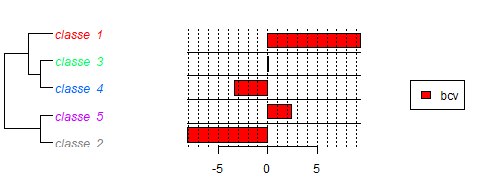
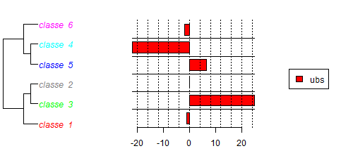

# Analyse

### Intérêt apporté au sujet du _secret bancaire_

Le sujet du secret bancaire à suscité une centaines de premières pages au sein
des deux journaux de 1940 jusque à la fin des années 90s. Ce chiffre rélativement
petit nous permets de lire les premières pages pour mieu contextualiser une
analyse quantitatives des auteurs et des sources de dépêches.

De manière générale et excluant l'année 1984 de l'initiative populaire au même
sujet, le secret bancaire n'est pas un sujet très important dans le corpus
financier des deux journaux. Le sous-corpus "secret bancaire" ne constitue que
5% des articles du corpus financier, qui lui-même ne contient que une petite
partie de tous les articles financiers. Il est remarquable que dans le sous-corpus
la proportion d'articles qui proviennent d'agences de presse et de dix pour-cent
plus élevé que dans le corpus financier (29% pour "secret bancaire", 18% pour
financier). Cela montre que le sujet a moins d'importance pour les rédactions,
elles utilisent souvent des dépêches pour parler du sujet.

Si nous voulons regarder de plus près l'origine de cet intérêt, nous sommes
amenés à comparer la fraction de dépêches venant de l'étranger à ceux de
l'Agence télégraphique suisse (ATS). La figure \ref{percentage} montre comment
cette fraction évolue dans le sous-corpus avec le temps. Nous trouvons deux
périodes où les dépêches étrangères ont une certaine présence: 1972 -- 1977 et
1986 -- 1992.

{ width=90% }

En revenant au contexte historique, nous pouvons citer quelques évènements qui
ont lieux dans ces deux périodes...

- 1972 – 77 bcp de noise, mais quand même:
  - investigations francaises
  - traité americo-suisse

- 1986 – 92:
  - on voit les scandales

La presse française (AFP) ne traite pas tellement l'initiative mais les suisses oui.

Les auteurs traitent surtout l'initiative, ils sont dans des milieux financiers actifs dans les deux journaux.

### Comparaison des deux journaux
En isolant les articles contenant “secret bancaire”, nous avons auparavant isolé les articles en différents groupes avec la méthode de Reinert. La première chose que nous remarquons c’est qu’entre les deux journaux on obtient des groupes différents. 
Afin de mieux comprendre comment les articles sont classés nous avons aussi effectué des Chi²-tests sur des mots-clés.
Par exemple dans le Journal de Genève, nous pouvons voir que le terme “bcv” va éloigner un article du groupe contenant les termes plus généralement associé aux banques.
{ width=90% }

D’autres tests similaires pointent vers d’autres division, ou les articles utilisants des termes juridiques et/ou techniques précis (comme “banquaire”, “fraude”, “autorité”) vont concentrer les articles dans une même classe.Évoquant des articles ne faisant que relater des faits ou qui va juste relater les faits. Mais on voit aussi que les termes qui ramènent au nom des banques sont dissociés des groupes parlant de l’actualité du secret bancaire à l’époque étudiée.

Du côté dans la Gazette de Lausanne, on trouve 6 groupes qui se forment. Là ou le Journal de Genève semble avoir des classes qui sont basée sur des sujets différents (économie, affaires judiciaires, légal) . Dans la Gazette de Lausanne il semble que les événements marquants de la période génèrent plus d’attentions, car on retrouve une classe avec des mots rappelant des affaires judiciaires. Dans cette classe on retrouve des termes tels que “renseignement”, “tribunal”, “violer” .. Cela semble indiquer que les différents scandals ou affaires judiciaires entourant le secret bancaire sont perçues comme plus importante dans la Gazette de Lausanne que le Journal de Genève.
Cependant ici, comme dans le Journal de Genève le nom des banques suisse apparaît plutôt dans le groupe d’articles référençant des termes financiers plus généraux (avec les noms de devises, des quantités)
{ width=90% }

Tout ceci semble indiquer que, même si l’emphase apportée sur les différents événements entourant l’histoire du secret bancaire au XXe siècle est différentes entre les deux journaux, les deux semblent aussi dissocier les banques du sujet même du secret bancaire.
### Conclusions

messages principaux de la partie de Yann:
- le sujet n'est pas tellement important (bcp de dépêches)
- les étrangers (français) s'intéressent surtout aux scandales
- les suisses plutôt à l'initiative
=> les auteurs/rédactions ne critiquent pas trop, mais défendent plutôt

- différence de couverture dans les deux journaux: _GDL_ plus d'importance aux affaires
- les deux ne pointent pas du doigt
=> le secret bancaire est abordé dans le context politique et pas financier/économique
