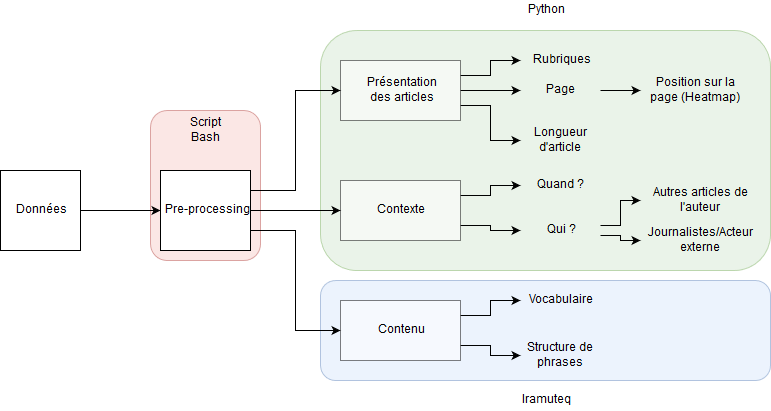

# Méthodologie

(Romain)
--> mettre au présent
--> merge la méthodologie du semestre passé

Notre idée centrale est de porter l’analyse sur la différence entre les deux
journaux et leur évolution dans le temps. La méthodologie détaillée ici sera
donc appliquée sur les deux journaux séparément et elle sera organisé en trois
catégories.

  - La présentation des articles
  - Le contexte des articles
  - Le contenu des articles

### Pre-processing

Afin de conduire notre analyse, nous devons réduire le corpus pour l'explorer de
manière plus rapide et interactive. Le corpus de base se constitue de tous les
articles de la _Gazette de Lausanne_ et du _Journal de Genève_ sortis entre 1900
et 1999. Les données nous parviennent compressées en format `bzip2` et occupent
en total 18 Go sur le disque. Nous créons trois sous-corpus dont on ce sert dans
notre analyse. Le plus grand est consitué de touts les articles, décompréssés et
sans métadonnées concernantes la position des mots dans l'article. On ce sert de
ce corpus de 9 Go quand nous exigeons des informations qui regardent l'intierté
des journaux, comme les noms des hauteurs ou la longeur en page du journal à une
certaine date. Le deuxième corpus se limite aux articles de caractère financier
et est extrait du premier corpus par la recherche des suivants môts clés dans les
articles:
_secret bancaire, place financière, banques suisses, fortait fiscal, paradis
fiscal, affaire Chiasso, argent sale, blanchiment_.
Nous utilisons ce corpus, qui est consitué de ~35k articles, pour nous comparer
avec notre troisième corpus, sélectionné par le seul môt clés _secret bancaire_,
contennant environs 1700 articles.
De cette façon, nous pouvons détérminer si une certaine tendence de ce corpus
est vraiment signifiante, ou si elle est propre de tout le corpus financier.

### Analyse de la présentation

Nous cherchons à comprendre et comparer la façon dont le sujet du secret
bancaire suisse est abordé dans les deux journaux. Cela pose la question de la
présentation des articles. À quelle page peut-on trouver les articles? Cette
question nous permettra d’évaluer l’importance du sujet pour les deux journaux,
en regardant si le sujet occupe la première ou s’il est dans les pages
ultérieures. Nous voudrions aussi créer une _heatmap_[^1] de la position des
articles sur la page, afin de voir si les articles se trouvent, par exemple,
toujours en haut de la page. En plus, nous vérifierons si les articles sur le
secret bancaire font parti d’une rubrique récurrente ou non. Finalement, nous
évaluerons la longueur des articles, un long article indiquant que le sujet est
perçu comme important par la rédaction.

(Pietro)
--> N-Gram
--> lister les analyses faites (tease the results)

[^1]: Une _heatmap_, en français "carte thermique", est une graphique qui
indique la fréquence ou l'intensité de la donnée à chaque position dans un
cadre au moyen d'une couleur.

### Analyse du contexte

Le contexte d'un article inclut le date de publication. Celle-ci est la
méta-donnée la plus importante, car elle peut facilement être mise en relation
avec l’évolution du sujet.

La deuxième méta-donnée centrale est l'auteur dont nous avons deux catégories.

- **Journalistes**: Nous essayerons de mettre en perspective l’activité d’un
  journaliste. Est-ce un journaliste généraliste ou spécialisé? Quelles sont
  les thématiques de ses autres articles? De quand à quand est-il actif?

- **Auteurs externes**: Est-ce que l’auteur s’exprime au nom d’une institution
  comme par exemple une banque ou est-ce un représentant politique? Quel est le
  contexte de l'intervention médiatique pour cette institution?

(Yann)
--> lister les analyses faites (tease the results)

### Analyse du contenu

Pour finir, nous nous intéressons directement aux articles. Cependant nous
allons nous arrêter à des observations objectives. L’idée étant d’utiliser
_Iramuteq_ pour faire ressortir la structure des phrases et la distribution des
mots. Ainsi, nous mettrons en lumière la différence entre le vocabulaire employé
par les deux journaux afin de voir s'ils sont sur une couverture complètement
factuelle ou non. Nous voulons aussi tenter d’analyser le type de mot utilisé
par les deux journaux. Toutes ces analyses ont pour but de faire ressortir les
différences entre la manière dont les deux journaux parlent du sujet du secret
bancaire suisse.

(Romain Iramuteq)
--> Dendogram par journal: regarder les différences
--> lister les analyses faites (tease the results)
