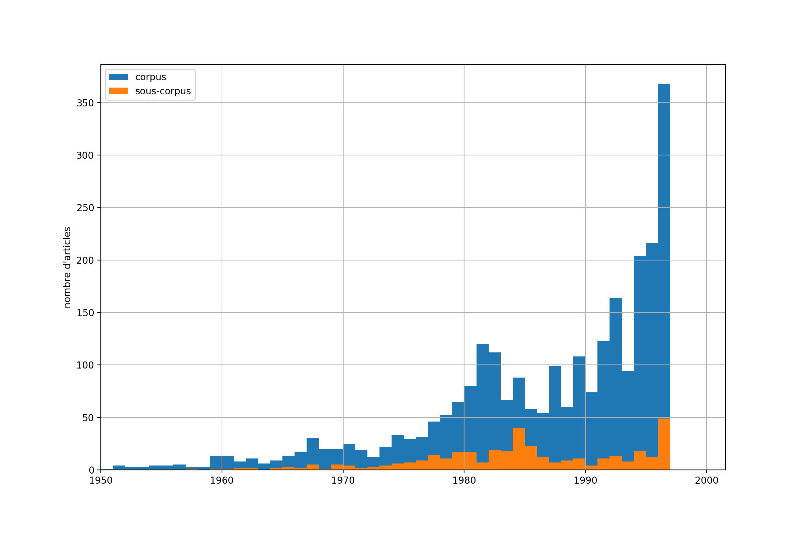

# Méthodologie

(TODO: Romain)
--> mettre au présent
--> merge la méthodologie du semestre passé

Notre idée centrale est de porter l’analyse sur la différence entre les deux
journaux et leur évolution dans le temps. La méthodologie détaillée ici sera
donc appliquée sur les deux journaux séparément et elle sera organisé en trois
catégories.

  - La présentation des articles
  - Le contexte des articles
  - Le contenu des articles

## Pre-processing

Afin de conduire notre analyse, nous devons réduire le corpus pour l'explorer de
manière plus rapide et interactive. Le corpus de base se constitue de tous les
articles de la _Gazette de Lausanne_ et du _Journal de Genève_ sortis entre 1900
et 1999. Les données nous parviennent compressées en format `bzip2` et occupent
en total 18 Go sur le disque. Si les données sont décomprimées, le volume
s'augmente d’un facteur dix. Ceci nous cause un problème, car plus que 200 Go de
données ne rentrent pas dans la mémoire RAM d'un ordinateur, limitant les
méthodes que nous pouvons appliquer.

Pour résoudre ce problème, nous pourrions opérer sur les données en les
décompressant au moment du besoin. Mais cette approche  introduit de longs temps
d'élaboration. Effectivement, le format `bzip2` permet une forte réduction de la
taille des fichiers, mais à coût d'un long temps de décompression. Une
expérience confirme que pour chercher les mots "secret bancaire" dans un fichier
`bzip2` contenant les articles du _Journal de Genève_ de 1970, la décompression
nécessite 24.1s alors que le temps de recherche est de 0.6s. Pour cette raison
nous  travaillerons sur un sous-ensemble des données décomprimées à l'avance.
Mais nous souhaitons ne pas limiter notre corpus aux articles qui contiennent un
des mots clés, car les autres articles seront utiles pour effectuer d’autres
analyses, comme trouver tous les articles par un même auteur. Le problème
consiste donc à réduire les 200 Go de données brutes pour les  manipuler
aisément.

Pour cela, nous ignorons les méta-données sur la position des mots sur la page
qui occupent environ 90% du volume et ne sont pas nécessaires à nos analyses.
Nous les gardons seulement pour les quelques articles qui contiennent un de nos
mots clés. De cette façon, nous travaillons avec environ 9 Go de données
décomprimées. Une recherche par mots clés passe ainsi de 1h30 sur les données
compressées à une minute sur les données nettoyées et décomprimées.

(TODO: Pietro)
--> raccourcir
--> Deux corpus: base (mots-clés) et secret bancaire sous-corpus

## Analyse de la présentation

Nous cherchons à comprendre et comparer la façon dont le sujet du secret
bancaire suisse est abordé dans les deux journaux. Cela pose la question de la
présentation des articles. À quelle page peut-on trouver les articles? Cette
question nous permettra d’évaluer l’importance du sujet pour les deux journaux,
en regardant si le sujet occupe la première ou s’il est dans les pages
ultérieures. Nous voudrions aussi créer une _heatmap_[^1] de la position des
articles sur la page, afin de voir si les articles se trouvent, par exemple,
toujours en haut de la page. En plus, nous vérifierons si les articles sur le
secret bancaire font parti d’une rubrique récurrente ou non. Finalement, nous
évaluerons la longueur des articles, un long article indiquant que le sujet est
perçu comme important par la rédaction.

(TODO: Pietro)
--> N-Gram
--> lister les analyses faites (tease the results)

[^1]: Une _heatmap_, en français "carte thermique", est une graphique qui
indique la fréquence ou l'intensité de la donnée à chaque position dans un
cadre au moyen d'une couleur.

## Analyse du contexte

Le contexte d'un article inclut le date de publication. Celle-ci est la
méta-donnée la plus importante, car elle peut facilement être mise en relation
avec l’évolution du sujet mais elle a déjà été exploré dans l'analyse
précédente.

La deuxième méta-donnée centrale est l'auteur dont nous avons deux catégories.

#### Agences de presse

Beaucoup d'articles dans un journal proviennent d'agences de presse et ne sont pas
écrits par un journaliste de la rédaction. Nous classifions les articles des
agences suivantes:

- ATS: Agence télégraphique suisse
- AFP: Agence France-Presse
- Reuters
- AP: Associated press

En comptant tous les articles qui sont issu d'une agence dans le corpus de base
et dans le sous-corpus, nous trouvons que pour les articles du secret bancaire
le taux d'articles d'agences et 10\% plus haut que dans le corpus de base.

#### Journalistes

Même si l'auteur d'un article n'est pas toujours indiqué – surtout dans la
première moitié du siècle – nous arrivons à extraire des données sur les
journalistes. Au moyen d'une liste de noms d'auteurs[^2] et des initiales qui
sont utilisé pour signer un article, nous pouvons attribuer des auteurs à plus
que 2600 articles. Le graphe en-bas montre que ces articles se trouvent pour la
plupart vers la fin du corpus pour la raison mentionné en-haut.

{ width=60% }

Cette attribution nous permet de tenter de répondre aux questions suivantes:
Est-ce un journaliste est actif dans le deux journaux en même temps? Est-ce
qu'il écrit en moyenne plus souvent sur le sujet du secret bancaire que sur
d'autres sujets? De quand à quand est-il actif?

Comme exemple, voici les trois auteurs du _JDG_ qui ont écrit le plus sur le
secret bancaire: Jean-Luc Lederrey (41 articles), Jacques-Simon Eggly (29
articles) et Sylvie Arsever (18 articles). Ce qui  est intéressant est que les
deux en premiers sont aussi très actifs dans la _GDL_ et cela même avant la
fusion des rédactions en 1991. Jean-Luc Lederrey a publié 35 articles dans la
_GDL_ avant 1991 et Jacques-Simon Eggly 28 articles. En plus, une recherche
LinkedIn ou Wikipédia révèle que les deux étaient actifs dans le monde banquier[^3]
ou dans la politique libérale[^4].

[^2]: Cette liste était obtenue de la page [Wikipédia du _Journal de
Genève_](https://fr.wikipedia.org/wiki/Journal_de_Gen%C3%A8ve).

[^3]: [Jean-Luc Lederrey sur
LinkedIn](https://ch.linkedin.com/in/lederrey-jean-luc-1456b717).

[^4]: [Jean-Simon Eggly sur
Wikipédia](https://fr.wikipedia.org/wiki/Jacques-Simon_Eggly).

## Analyse du contenu

Pour finir, nous nous intéressons directement aux articles. Cependant nous
allons nous arrêter à des observations objectives. L’idée étant d’utiliser
_Iramuteq_ pour faire ressortir la structure des phrases et la distribution des
mots. Ainsi, nous mettrons en lumière la différence entre le vocabulaire employé
par les deux journaux afin de voir s'ils sont sur une couverture complètement
factuelle ou non. Nous voulons aussi tenter d’analyser le type de mot utilisé
par les deux journaux. Toutes ces analyses ont pour but de faire ressortir les
différences entre la manière dont les deux journaux parlent du sujet du secret
bancaire suisse.

(TODO: Romain Iramuteq)
--> Dendogram par journal: regarder les différences
--> lister les analyses faites (tease the results)

## Critique et difficultées

- OCR de mauvaise qualité
- pas de noms d'auteurs pour les articles avant 1960
- pas de liste d'auteurs sur Internet de la _GDL_
