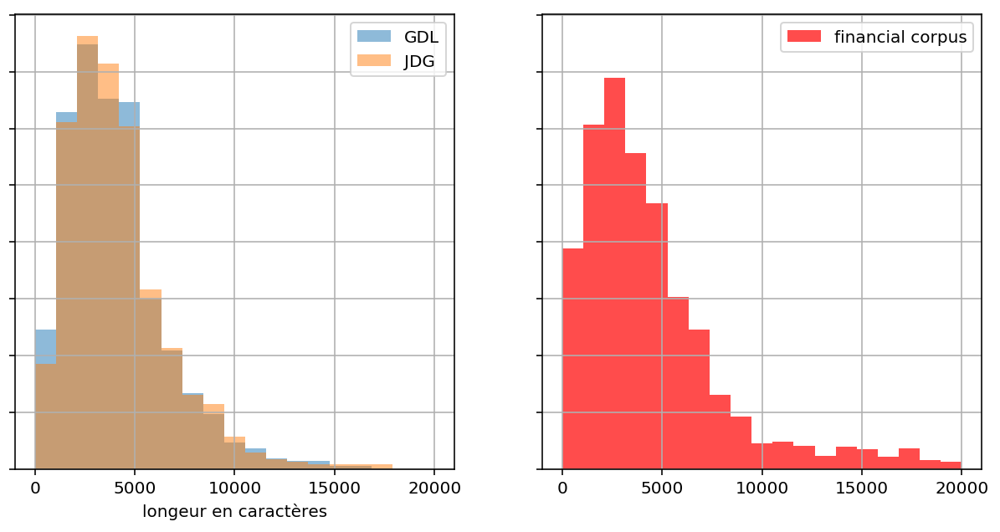
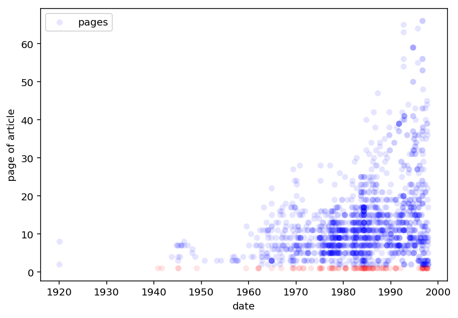
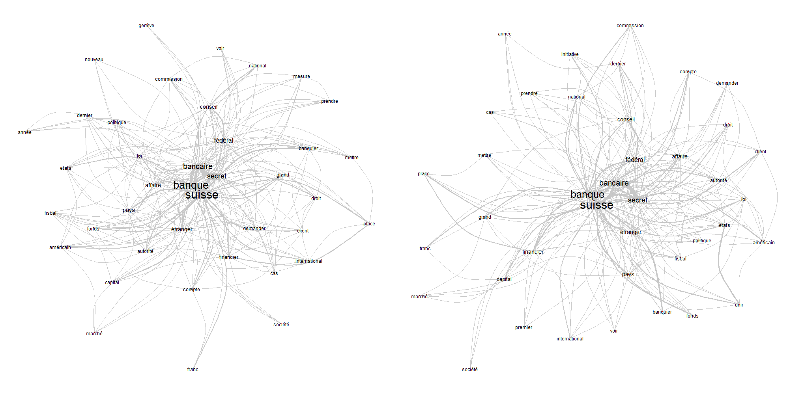
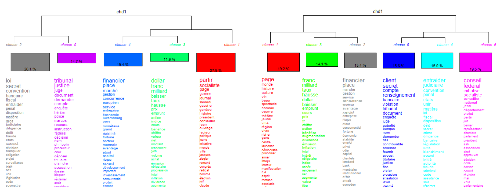
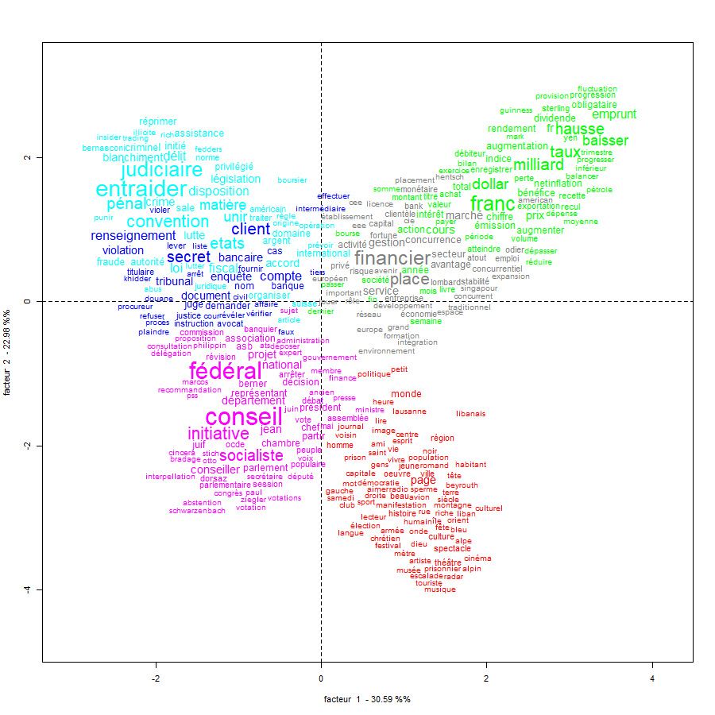
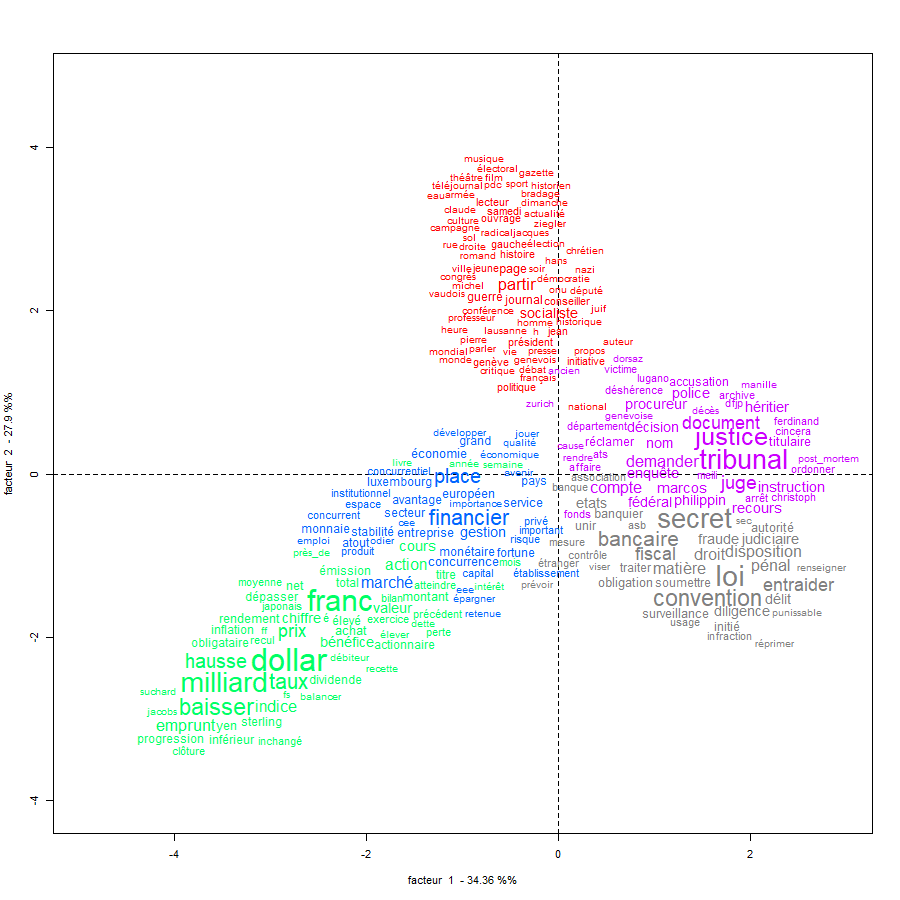

## Méthodologie

Notre idée centrale est de porter l’analyse sur la différence entre les deux
journaux et leur évolution dans le temps. La méthodologie détaillée ici est donc
appliquée sur les deux journaux séparément et elle est organisé de manière
suivante:

{ width=70% }

### Pre-processing

Pour l'explorer de manière plus rapide, nous devons réduire le corpus de base
qui se constitue des articles de la _Gazette de Lausanne_ (_GDL_) et du _Journal
de Genève_ (_JDG_) sortis entre 1900 et 1999.  

Nous créons trois corpus. Le plus grand est constitué de tous les articles,
décomprimés (du format `bzip2`) et sans méta-données concernant la position des
mots sur la page. Nous nous servons de ce corpus-là pour des questions qui
regardent l'entièreté des journaux, comme la longueur en page du journal à une
certaine date.

Le deuxième corpus se limite aux articles de caractère financier
et est extrait du premier corpus par la recherche des mots clés suivants:

- secret bancaire
- place financière
- banques suisses
- forfait fiscal
- paradis fiscal
- affaire Chiasso
- argent sale
- blanchiment

Nous utilisons ce corpus de ~35'000 articles pour nous comparer avec notre
troisième corpus, sélectionné par le seul mot clé "secret bancaire", contentant
environ 1700 articles. De cette façon, nous pouvons déterminer si une certaine
tendance de ce corpus est vraiment signifiante, ou si elle apparaît dans tout le
corpus financier.

### Statistiques de base

Nous commençons en calculant certaines statistiques de base, telles que le
numéro de page, la longueur et la date d'un article.  Nous reproduisons donc le
N-Gram dans le temps, pour les articles contenant "secret bancaire" par année.

Ensuite, nous comparons la longueur d'un article sur le secret bancaire aux
articles génériques du corpus financier. Nous pouvons constater en regardant
l'histogramme suivant que les articles sur le secret bancaire, dans les deux
journaux, sont en général un peu plus longs.

{ width=60% }

Nous examinons aussi, à l'aide d'un histogramme de la page de l'article, la
distribution de la position des articles sur le secret bancaire. Pour mieux
interpréter les résultats de cette analyse, nous trouvons la longueur du journal
pour chaque date et calculons ainsi la position relative de l'article dans le
journal. Nous cherchons enfin à voir si des rubriques spécialisées traitent le
sujet, en examinant des nuages de points corrélants la date et la page des
articles en question. Des ligne horizontales isolées constituerait un indice
d'une rubrique permanente.

{ width=50% }

En comparant le nombre d'article en première page, nous constatons que la
fréquence d'une première page pour un article sur le secret bancaire est de 5%
dans la _GDL_ et 6% dans le _JDG_. Alors que la fréquence d'une première page
pour un article générique financier est de 2% pour la _GDL_ et 3% pour la _JDG_.

### Analyse des auteurs

La méta-donnée la plus importante après la date qui est traitée en haut est
l'auteur d'un article. Nous analysons deux catégories d'auteurs.

#### Agences de presse

Beaucoup d'articles de journal proviennent d'agences de presse externes à la
rédaction. Nous classifions les articles des agences suivantes:

- ATS: Agence télégraphique suisse
- AFP: Agence France-Presse
- Reuters
- AP: Associated press

Ainsi nous trouvons que pour les articles du secret bancaire le taux d'articles
issus d'agences et 10\% plus haut que dans le corpus financier.

\newpage

#### Journalistes

Même si l'auteur n'est pas toujours indiqué – surtout dans la première moitié du
siècle – nous arrivons à extraire des données sur les journalistes. Au moyen
d'une liste de noms d'auteurs[^2] et des initiales à la fin de l'article, nous
pouvons attribuer des auteurs à plus que 2600 articles.

{ width=60% }

Cette attribution nous permet de poser les questions suivantes: Est-ce qu'un
journaliste est actif dans le deux journaux en même temps? Est-ce qu'il écrit en
moyenne plus souvent sur le secret bancaire que sur d'autres sujets?

Comme exemple, nous voyons que les deux auteurs du _JDG_ qui ont écrit le plus
sur le secret bancaire sont Jean-Luc Lederrey (41 articles) et Jacques-Simon
Eggly (29 articles). Les deux sont aussi  actifs dans la _GDL_ et cela même
avant la fusion des rédactions en 1991. En plus, une recherche LinkedIn ou
Wikipédia révèle que les deux travaillaient aussi dans le monde banquier[^3] ou
dans la politique libérale[^4].

[^2]: Cette liste était obtenue de la page [Wikipédia du _Journal de
Genève_](https://fr.wikipedia.org/wiki/Journal_de_Gen%C3%A8ve).

[^3]: [Jean-Luc Lederrey sur
LinkedIn](https://ch.linkedin.com/in/lederrey-jean-luc-1456b717).

[^4]: [Jean-Simon Eggly sur
Wikipédia](https://fr.wikipedia.org/wiki/Jacques-Simon_Eggly).

### Analyse du contenu

L'analyse de contenu se limite au corpus "secret bancaire". Dans un premier
temps nous produisons des graphiques d'analyses de similitudes pour les deux
journaux.

{ width=90% }

En regardant le résultat on voit que les mots qui apparaissent souvent avec
"secret bancaire" dans les textes de la _GDL_ et du _JDG_ sont différents. Pour
la _GDL_ on voit des mots tel que "affaire" qui apparaissent et qu'on ne voit
pas dans le résultat avec le _JDG_.

Afin de rendre les visuels utilisables, nous affichons ici seulement 40 mots
(autres que préposition et déterminants). Afin de ne pas surcharger l'image,
seuls les termes qui apparaissent plus de 50 fois ensemble sont montrés reliés
dans le graphe.

En suite, toujours dans un esprit de comparaison des journaux, nous produisons
deux dendrogrammes sur les journaux.

Cela nous permet de comparer le langage utilisé dans les deux journaux, nous
voyons qu'un journal a été organisé en cinq clusters et l'autre en six, montrant
une divergence dans la façon d'aborder le sujet. Les champs lexicaux sont
proches mais cela nous n'apporte encore rien sur le contexte d'utilisation des
mots.

En poussant cette idée plus loin, nous obtenons les graphes AFC.

Cette visualisation nous présente les distances entre des mots dans le texte, et
nous permet de voir qu'entre les deux journaux le vocabulaire employé est plus
variable dans la gazette de Lausanne.

Avec ces informations, nous pouvons déjà observer que le style d'écriture des
articles est différent. Nous observons par exemple que la _GDL_ semble mettre
ensemble des articles qui parlent de secret bancaire avec des articles qui
parlent d'affaires judiciaires (avec les mots "secret", "bancaire" proche du mot
"judiciaire").

### Critique et difficultées

Notre analyse est particulièrement perturbée par les problèmes de l'OCR de basse
qualité. Car, les termes que nous tentons d'isoler sont plutôt long et une
erreur de reconnaissance est bien plus probable.

Un autre problème est que le format de reconnaissance des articles est assez
limité. Il a fallu que nous allions chercher le nom des auteurs manuellement,
cependant nous avons observé que mettre le nom de l'auteur sur un article de
journal ne devient courant qu'à partir des années 60, limitant nos capacité
d'analyse avant cette période.

Nous avons réussi à contourner ce problème en utilisant une liste de noms de
journalistes ayant travaillé pour le _JDG_. Cependant nous n'avons pas trouvé
une telle liste pour la _GDL_.

{ width=80% }

{ width=80% }
