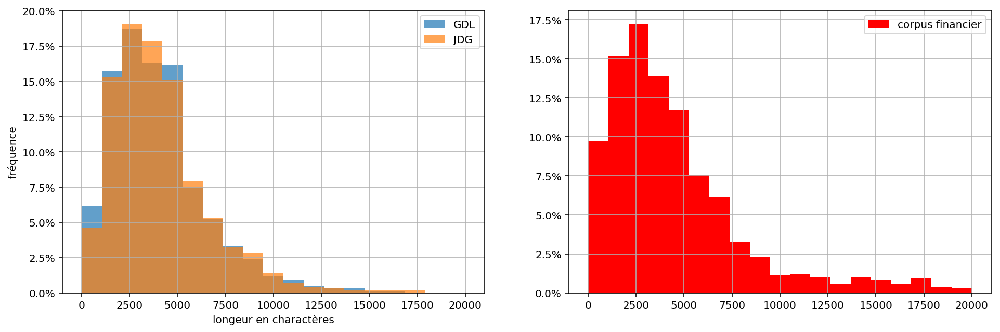

# Méthodologie

Notre idée centrale est de porter l’analyse sur la différence entre les deux
journaux et leur évolution dans le temps. La méthodologie détaillée ici sera
donc appliquée sur les deux journaux séparément et elle sera organisé en trois
catégories.

  - La présentation des articles
  - Le contexte des articles
  - Le contenu des articles

## Pre-processing

Afin de conduire notre analyse, nous devons réduire le corpus pour l'explorer
de manière plus rapide et interactive. Le corpus de base se constitue de tous
les articles de la _Gazette de Lausanne_ et du _Journal de Genève_ sortis entre
1900 et 1999. Les données nous parviennent compressées en format `bzip2` et
occupent en total 18 Go sur le disque. Nous créons trois sous-corpus dont on ce
sert dans notre analyse. Le plus grand est consitué de touts les articles,
décompréssés et sans métadonnées concernantes la position des mots dans
l'article. On ce sert de ce corpus de 9 Go quand nous exigeons des informations
qui regardent l'intierté des journaux, comme les noms des hauteurs ou la
longeur en page du journal à une certaine date. Le deuxième corpus se limite
aux articles de caractère financier et est extrait du premier corpus par la
recherche des suivants môts clés dans les articles: _secret bancaire, place
financière, banques suisses, fortait fiscal, paradis fiscal, affaire Chiasso,
argent sale, blanchiment_.  Nous utilisons ce corpus, qui est consitué de ~35k
articles, pour nous comparer avec notre troisième corpus, sélectionné par le
seul môt clés _secret bancaire_, contennant environs 1700 articles.  De cette
façon, nous pouvons détérminer si une certaine tendence de ce corpus est
vraiment signifiante, ou si elle est propre de tout le corpus financier.

## Statistiques de base

Pour nous approcher à l'analyse des articles, nous commençons en calculant et
en visualisant certaines statistiques de base des articles, tel que le numéro
de page, la longeur, ou la date.  Nous reproduisons donc le diagramme de N-Gram
dans le temps, simplement en contant le nombre d'article sur le secret bancaire
par années.

Nous cherchons en suite à comparer la longeur d'un article sur le secret
bancaire par rapport à un article générique du corpus financier. Nous pouvons
constater en regardant les histogrammes du numéro de charactères par articles
que les articles sur le secret bancaire, dans les deux journaux, sont en
général un peu plus longs que les articles de finance génériques.

Nous éxaminons aussi, à l'aide d'un histogrammes de la page de l'article, la
distribution des position des articles sur le secret bancaire, et des article
financier en général.  Pour mieux interpreter les résultats de l'analyse de
position dans le journal des articles, nous trouvons la longeur du journal pour
chaque date, et calculons ainsi la position rélative de l'article dans le
journal.  Nous cherchons enfin à voir si des rubriques spécialisées traitent le
sujet, en éxaminant des nuages de points corrélants la date et la page des
articles en question. Des ligne horizontales isolées, dans ces nuage de points,
constituerait un indice d'une rubrique permanente qui traite la question à la
page spécifique.

{ width=60% }

## Analyse du contexte

Le contexte d'un article inclut la date de publication. C'est la
méta-donnée la plus importante, car elle peut facilement être mise en relation
avec l’évolution du sujet mais elle a déjà été exploré dans l'analyse
précédente.

La deuxième méta-donnée centrale est l'auteur dont nous avons deux catégories.

#### Agences de presse

Beaucoup d'articles dans un journal proviennent d'agences de presse et ne sont pas
écrits par un journaliste de la rédaction. Nous classifions les articles des
agences suivantes:

- ATS: Agence télégraphique suisse
- AFP: Agence France-Presse
- Reuters
- AP: Associated press

En comptant tous les articles qui sont issu d'une agence dans le corpus de base
et dans le sous-corpus, nous trouvons que pour les articles du secret bancaire
le taux d'articles d'agences et 10\% plus haut que dans le corpus de base.

#### Journalistes

Même si l'auteur d'un article n'est pas toujours indiqué – surtout dans la
première moitié du siècle – nous arrivons à extraire des données sur les
journalistes. Au moyen d'une liste de noms d'auteurs[^2] et des initiales qui
sont utilisé pour signer un article, nous pouvons attribuer des auteurs à plus
que 2600 articles. Le graphe en-bas montre que ces articles se trouvent pour la
plupart vers la fin du corpus pour la raison mentionné en-haut.

{ width=60% }

Cette attribution nous permet de tenter de répondre aux questions suivantes:
Est-ce un journaliste est actif dans le deux journaux en même temps? Est-ce
qu'il écrit en moyenne plus souvent sur le sujet du secret bancaire que sur
d'autres sujets? De quand à quand est-il actif?

[^2]: Cette liste était obtenue de la page [Wikipédia du _Journal de
Genève_](https://fr.wikipedia.org/wiki/Journal_de_Gen%C3%A8ve).

[^3]: [Jean-Luc Lederrey sur
LinkedIn](https://ch.linkedin.com/in/lederrey-jean-luc-1456b717).

[^4]: [Jean-Simon Eggly sur
Wikipédia](https://fr.wikipedia.org/wiki/Jacques-Simon_Eggly).

## Analyse du contenu

L'analyse de contenu se limitera aux articles avec `secret bancaire` dedans.
Ensuite, les articles sont convertits dans un format que Iramuteq 
peut comprendre.

Dans un premier temps nous produisons des graphiques d'analyses de 
similitudes pour les deux journaux:
#### Analyses de similitudes dans la Gazette de Lausanne

#### Analyses de similitudes dans le Journal de Genève

Afin de rendre les visuels utilisables on affiche ici que les 40 mots 
(autres que préposition et déterminants), de la même façon seuls les termes 
qui apparaissent plus de 50 fois ensemble sont montrés.

En suite, toujours dans un esprit de comparaison des journaux, nous produisons 2 dendrogrammes sur les journaux.
#### Dendrogramme de la Gazette de Lausanne

#### Dendrogramme du Journal de Genève

Après ses 2 étapes on perçois déjà de larges différences entre les deux journaux.

## Critique et difficultées

Un problème est apparu pendant la recherche des méta-données. Le format de reconnaissance
des articles est assez limité, il a fallu que nous allions chercher le nom des auteurs manuellement,
cependant nous avons observé que mettre le nom de l'auteur sur un article de journal ne deviens
courant qu'à partir des années 60, limitant nos capacité d'analyse avant cette période.

Nous avons réussi à contourner ce problème en utilisant une liste de noms de journalistes 
ayant travaillé pour le Journal de Genève. Cependant nous ne trouvons pas de telle liste
pour la Gazette de Lausanne.
