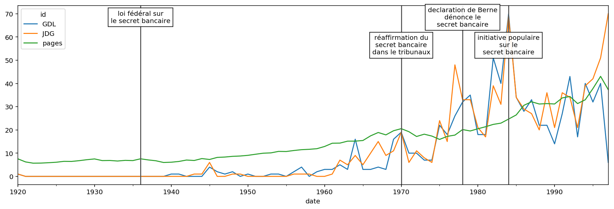

# Méthodologie

Notre idée centrale est de porter l’analyse sur la différence entre les deux
journaux et leur évolution dans le temps. La méthodologie détaillée ici est donc
appliquée sur les deux journaux séparément et elle est organisé en trois
catégories.

  - La présentation des articles
  - Le contexte des articles
  - Le contenu des articles

{ width=50% }

## Pre-processing

Pour notre analyse, nous devons réduire le corpus pour l'explorer de manière
plus rapide. Le corpus de base se constitue de tous les articles de la _Gazette
de Lausanne_ (_GDL_) et du _Journal de Genève_ (_JDG_) sortis entre 1900 et
1999. Les données nous parviennent compressées en format `bzip2` et occupent en
total 18 Go sur le disque. Nous créons trois sous-corpus. Le plus grand est
constitué de tous les articles, décomprimés et sans méta-données concernant la
position des mots dans l'article. Nous nous servons de ce corpus-là pour des
questions qui regardent l'entièreté des journaux, comme la longueur en page du
journal à une certaine date. Le deuxième corpus se limite aux articles de
caractère financier et est extrait du premier corpus par la recherche des
mots clés suivants:

- secret bancaire
- place financière
- banques suisses
- forfait fiscal
- paradis fiscal
- affaire Chiasso
- argent sale
- blanchiment

Nous utilisons ce corpus, qui est constitué de ~35'000 articles, pour nous
comparer avec notre troisième corpus, sélectionné par le seul mot clé _secret
bancaire_, contentant environ 1700 articles. De cette façon, nous pouvons
déterminer si une certaine tendance de ce corpus est vraiment signifiante, ou si
elle apparait dans tout le corpus financier.

## Statistiques de base

Pour s'approcher à l'analyse des articles, nous commençons en calculant et
certaines statistiques de base, telles que le numéro de page, la longueur et la
date.  Nous reproduisons donc le N-Gram dans le temps, pour les articles contant
"secret bancaire" par année.

Ensuite, nous comparons la longueur d'un article sur le secret bancaire aux
articles génériques du corpus financier. Nous pouvons constater en regardant
l'histogramme suivant que les articles sur le secret bancaire, dans les deux
journaux, sont en général un peu plus longs que les articles de finance
génériques.

{ width=70% }

Nous examinons aussi, à l'aide d'un histogramme de la page de l'article, la
distribution des position des articles sur le secret bancaire. Pour mieux
interpréter les résultats de cette analyse, nous trouvons la longueur du journal
pour chaque date et calculons ainsi la position relative de l'article dans le
journal. Nous cherchons enfin à voir si des rubriques spécialisées traitent le
sujet, en examinant des nuages de points corrélants la date et la page des
articles en question. Des ligne horizontales isolées constituerait un indice
d'une rubrique permanente qui traite le sujet à une page spécifique.

{ width=50% }

En comparant le nombre d'article en première page, nous constatons que la
fréquence d'une première page pour un article sur le secret bancaire est de 5%
dans la _GDL_ et 6% dans le _JDG_. En comparaison, la fréquence d'une première
page pour un article générique financier est de 2% pour la _GDL_ et 3% pour la
_JDG_.

## Analyse des auteurs

La méta-donnée la plus importante après la date qui est traitée en haut est
l'auteur d'un article. Nous analysons deux catégories d'auteurs.

#### Agences de presse

Beaucoup d'articles de journal proviennent d'agences de presse externes à la
rédaction. Nous classifions les articles des agences suivantes:

- ATS: Agence télégraphique suisse
- AFP: Agence France-Presse
- Reuters
- AP: Associated press

En comptant tous les articles qui sont issu d'une agence dans le corpus
financier et dans le sous-corpus "secret bancaire", nous trouvons que pour les
articles du secret bancaire le taux d'articles issus d'agences et 10\% plus haut
que dans le corpus financier.

#### Journalistes

Même si l'auteur d'un article n'est pas toujours indiqué – surtout dans la
première moitié du siècle – nous arrivons à extraire des données sur les
journalistes. Au moyen d'une liste de noms d'auteurs[^2] et des initiales qui
sont utilisé pour signer un article, nous pouvons attribuer des auteurs à plus
que 2600 articles. Le graphe en-bas montre leurs distribution dans le temps.

{ width=60% }

Cette attribution nous permet de tenter de répondre aux questions suivantes:
Est-ce un journaliste est actif dans le deux journaux en même temps? Est-ce
qu'il écrit en moyenne plus souvent sur le secret bancaire que sur d'autres
sujets? De quand à quand est-il actif?

Comme exemple, voici les trois auteurs du _JDG_ qui ont écrit le plus sur le
secret bancaire: Jean-Luc Lederrey (41 articles), Jacques-Simon Eggly (29
articles) et Sylvie Arsever (18 articles). Les deux en premiers sont aussi très
actifs dans la _GDL_ et cela même avant la fusion des rédactions en 1991. En
plus, une recherche LinkedIn ou Wikipédia révèle que les deux étaient actifs
dans le monde banquier[^3] ou dans la politique libérale[^4].

[^2]: Cette liste était obtenue de la page [Wikipédia du _Journal de
Genève_](https://fr.wikipedia.org/wiki/Journal_de_Gen%C3%A8ve).

[^3]: [Jean-Luc Lederrey sur
LinkedIn](https://ch.linkedin.com/in/lederrey-jean-luc-1456b717).

[^4]: [Jean-Simon Eggly sur
Wikipédia](https://fr.wikipedia.org/wiki/Jacques-Simon_Eggly).

## Analyse du contenu

L'analyse de contenu se limite au corpus "secret bancaire". Dans un premier
temps nous produisons des graphiques d'analyses de similitudes pour les deux
journaux:

--> expliquer ce que tu fais

#### Analyses de similitudes dans la Gazette de Lausanne
{ width=50% }

#### Analyses de similitudes dans le Journal de Genève
{ width=50% }

--> expliquer ce qu'on voit

Afin de rendre les visuels utilisables, nous affichons ici seulement les 40 mots
(autres que préposition et déterminants), de la même façon seuls les termes
qui apparaissent plus de 50 fois ensemble sont montrés.

En suite, toujours dans un esprit de comparaison des journaux, nous produisons 2 dendrogrammes sur les journaux.

#### Dendrogramme de la Gazette de Lausanne
{ width=50% }

#### Dendrogramme du Journal de Genève
{ width=50% }

Après ces deux étapes nous percevons déjà de larges différences entre les deux journaux. --> comme quoi?

## Critique et difficultées

Notre analyse est particulièrement perturbée par les problèmes de l'OCR de basse
qualité. Car, les termes que nous tentons d'isoler sont plutôt long une erreur
de reconnaissance est bien plus probable.

Un autre problème est que le format de reconnaissance des articles est assez
limité. Il a fallu que nous allions chercher le nom des auteurs manuellement,
cependant nous avons observé que mettre le nom de l'auteur sur un article de
journal ne deviens courant qu'à partir des années 60, limitant nos capacité
d'analyse avant cette période.

Nous avons réussi à contourner ce problème en utilisant une liste de noms de
journalistes ayant travaillé pour le _JDG_. Cependant nous ne trouvons pas de
telle liste pour la _GDL_.
